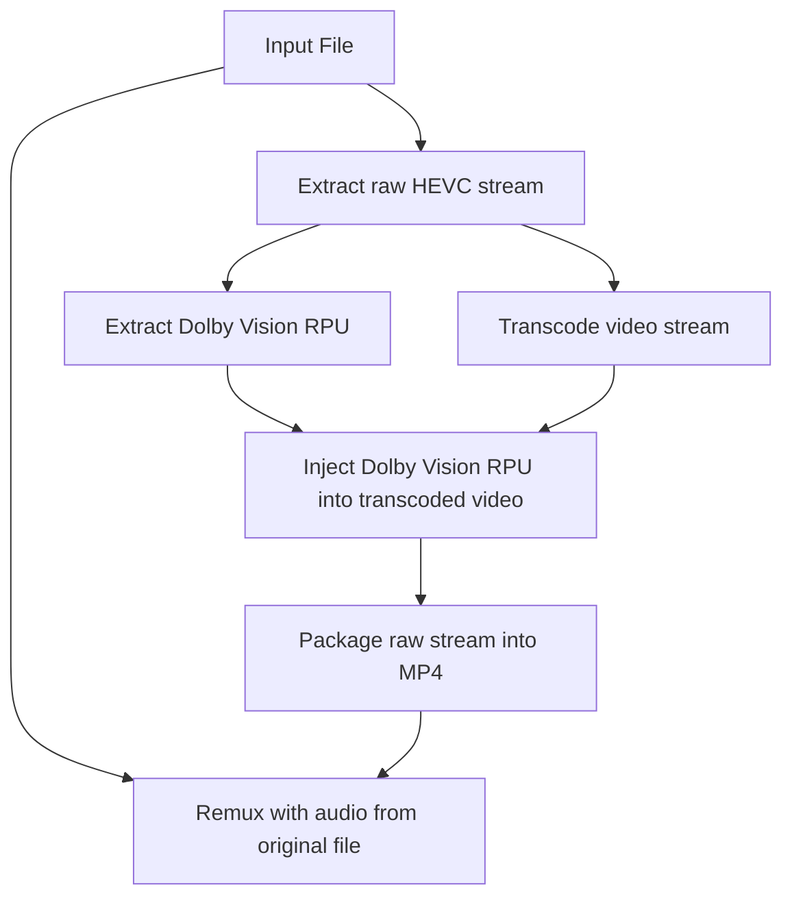

<p align="center">
  
</p>

Forked from [@HaveAGitGat Tdarr_Plugins](https://github.com/HaveAGitGat/Tdarr_Plugins)

# Tdarr_Plugins

Visit the docs for more info:
https://docs.tdarr.io/docs/plugins/basics

## Custom plugins
### Classic plugins
#### Nothing yet
### Flow plugins
#### improvedCheckHDRType

This is a comprehensive HDR detection plugin that uses multiple detection methods to ensure accurate identification:

- Checks for Dolby Vision using side data configuration records
- Looks for HDR format information in MediaInfo
- Examines color transfer functions, primaries, and spaces
- Checks for HDR metadata (master_display, light level info)
- Supports HLG detection

**Outputs:**
- **Output 1:** File is Dolby Vision
- **Output 2:** File is HDR10+
- **Output 3:** File is HDR10
- **Output 4:** File is HLG
- **Output 5:** File is SDR

**Use case:** When you need the most accurate and comprehensive HDR detection, especially for files with incomplete or non-standard metadata. This plugin is work for most workflows.

**Advantages:**
- Reliable detection of all HDR formats
- Detailed logging of which detection method succeeded
- Support for HLG format
- Multiple fallback detection methods

#### doviProfileDetector

The Dolby Vision Profile Detector plugin analyzes video files to detect if they contain Dolby Vision and identifies the specific profile.

The plugin is located at `FlowPluginsTs/CommunityFlowPlugins/video/doviProfileDetector/1.0.0/`.

Features:
- Detects Dolby Vision profiles 4, 5, 7, and 8
- Outputs to different paths based on the detected profile

The plugin has five outputs:
- **Output 1:** DolbyVision - profile 4
- **Output 2:** DolbyVision - profile 5
- **Output 3:** DolbyVision - profile 7
- **Output 4:** DolbyVision - profile 8
- **Output 5:** No DolbyVision/SDR

#### linplaceboColorspaceCorrection

This plugin applies libplacebo for colorspace and tonemapping fixes, especially useful for Dolby Vision content.

Features:
- Fixes colorspace issues in HDR and Dolby Vision content
- Applies tonemapping for proper display on SDR devices
- Configurable parameters for colorspace, primaries, and transfer characteristics
- Optional Dolby Vision processing
- Adjustable contrast recovery and tonemapping settings
- Supports various video codecs (NVENC and CPU-based)

The plugin provides the following configurable inputs:
- **Colorspace:** Target colorspace for the output video
- **Color Primaries:** Target color primaries for the output video
- **Color Transfer Characteristics:** Target transfer characteristics for the output video
- **Tonemapping Algorithm:** Algorithm to use for HDR to SDR conversion
- **Apply Dolby Vision:** Whether to apply Dolby Vision processing
- **Gamut Mode:** Color gamut mapping mode
- **Contrast Recovery:** Contrast recovery value (0.0-1.0)
- **Tonemapping LUT Size:** Size of the tonemapping lookup table
- **Video Codec:** Video codec to use for encoding
- **Encoding Preset:** Encoding preset (p1=slowest/best quality, p7=fastest/worst quality)
- **CQ/CRF Value:** Constant quality value (lower = better quality)

Example command:
```sh
tdarr-ffmpeg -i "input.mkv" -map 0:v -map 0:a -vf "libplacebo=colorspace=bt709:color_primaries=bt709:color_trc=bt709:tonemapping=4:apply_dolbyvision=true:gamut_mode=1:contrast_recovery=0.6:tonemapping_lut_size=256" -c:v hevc_nvenc -preset p4 -cq 18 -c:a copy "output.mp4"
```

The process for handling Dolby Vision content involves several steps, often chained together in a Tdarr flow:


**Note: requires Vulkan drivers to be configured correctly (at least for my setup)**
Ensure you've configured your Tdarr docker container for hardware transcoding (Nvidia) 
Install:
```
apt-get update && apt-get install libnvidia-gl-570-server
rm -rf /var/lib/apt/lists/*
```
Commit the changes to your docker image. See docker/Dockerfile for a quick and dirty example.

This process is based on the [dvmkv2mp4](https://github.com/gacopl/dvmkv2mp4) tool and writeup by [@gacopl](https://github.com/gacopl).
### Development

Make sure NodeJS v16 is installed

Install dependencies:

`npm install`

Run ESLint:

`npm run lint:fix`

Check plugins using some extra custom rules:

`npm run checkPlugins`

Run tests:

`npm run test`


# Steps to write a Tdarr Flow plugin:

1. Clone this repo
2. Set env variable `pluginsDir` to the location of the plugins repo and run Tdarr Server and Node. E.g. `export pluginsDir=C:/Tdarr_Plugins`
3. Browse the typescript plugins here https://github.com/HaveAGitGat/Tdarr_Plugins/tree/master/FlowPluginsTs/CommunityFlowPlugins and make edits locally or create a new one locally: 
4. Make sure typescript is intalled with `npm i -g typescript` then run `tsc` to compile the changes.
5. Refresh the browser and Tdarr will pick up the changes

Note, `pluginsDir` directories that contain a `.git` folder (such as when cloning this repo) will cause Tdarr to skip plugin updates to prevent overwriting development changes.


